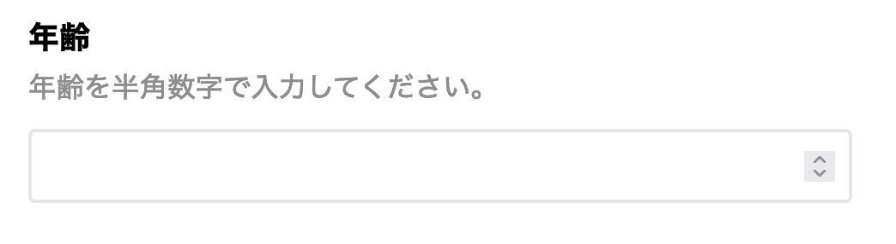
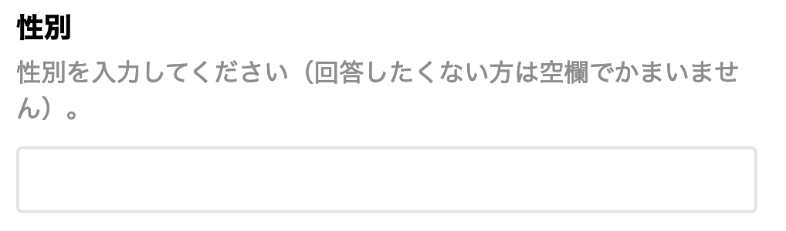

# 1. “スマホのブラウザ” で簡単に実験体験

## 概要
スマホ（スマートフォン）のブラウザで実験に参加する方法について説明します。実験の開始時には「同意書」の画面が表示されます。これは「実験参加者」の権利を守るために必要な最初のステップです。次は，「性別」と「年齢」の入力画面が表示されます。実験を行うために何に気をつける必要があるのでしょう？ぜひ一緒に体験しましょう。

## 体験デモ

<a href="./demo/ws_kisoshin2021/" target="_blank" rel="noopener noreferrer">[体験デモはこちらをクリック]</a>（クリックすると実験が始まるので注意）

## 1.1. 心理学で実験や調査を行う理由
### データの収集
"こころ"そのものは見えるわけではないので，それを見える形で取り出すためには様々な方法が必要になります。心理学は実証科学ですので，事実に基づいて知識の体系を構築していく必要があります。"こころ"を知るための手がかりは広い意味での行動（行為，言語報告，しぐさ，生理指標など）の中にあります。どんな条件下でどんな行動が起こるかデータを収集することで，"こころ"について検討をします。

### 実験とは？
実験は，統制された人工的な条件下で観察・測定する方法です。多くの実験はPC等が用いられます。計画的に条件を定めて，その条件によって起こる行動や行動の変化を観察し，記録します。

## 調査とは？
調査は，調査票（アンケート用紙）に答えを記入してもらう方法です。社会で起こっている心理学的な問題の実状を調べたり，人々の特性，意見，態度，興味，嗜好，知識などの個人差や関係を調べたりするのに使われます。

```note
#### web実験・調査について
スマホ（スマートフォン）のブラウザで実験・調査を実施するためには，ブラウザで利用可能なアプリケーションの作成と，実験の実行とデータを保存するためのホスティング用のサーバーが必要になります。Webページの多くはHTMLやCSSという言語によって構築されており，JavaScriptという言語によって動的に書き換えられています。また，皆さんのスマホ（Webクライアント）とWebサーバーでやりとりすることで実験・調査が行われます。
```

## 1.2. 実験・調査開始時に必要なこと
### 同意書の必要性
実験・調査を行う際には，事前に「実験・調査の実施者」，「内容」，「所要時間」，「リスク」，「利益」などを詳しく説明する必要があります。その上で，説明をよく理解して頂いた上で参加の同意を取得します。

このような「説明を受けた上での同意」のことをインフォームドコンセント（informed consent）と呼びます。

### 同意書には何が書かれているか？
どのような情報が書かれているでしょうか？　以下は典型例です。
- 実施責任者・実施者
- 実験・調査の目的
- 実験・調査の方法
- 実験・調査の所要時間（概算）
- 参加に伴うリスク・苦痛
- 参加に伴う利益
- 個人情報保護とその方法
- 参加と中止とその方法（同意の撤回）
- 問い合わせ先
- 実験・調査への同意チェック

### 同意書にはどのように答えればいいのか？
気がつかないうちに参加に同意していたという事態を避けるため，参加者に何らかの操作を行ってもらって同意を取得するようになっています。

具体的には，チェックをしないと次に進むボタンを押しても先に進まないなど。

## 1.3. デモグラフィック変数とは？
**デモグラフィック変数**とは，年齢，性別，職業，家族構成などの客観的・外面的な特性です。心理学の実験・調査では年齢と性別を聞くことが一般的です。

### 年齢
年齢については，大学生以上を対象とすることが多いため18歳以上で回答を求めることが多いと思います。特に子どもを対象とした実験や調査を行う場合は保護者の方の同意が必要です。



### 性別
心理学実験，調査では多くの場合，性別の入力を求めます。多様な書き方が考えられるので(性の多様性に配慮するため)，「自由記述」で回答してもらうのが良いと思います。また，未記入でも先に進めるようにしておく必要もあるでしょう。




## 1.4. より詳しく知りたい方へ(詳細な説明は省略)

### 同意書画面を体験してみよう

以下のリンクをクリックすると同意書画面が表示されます（内容はダミーです）。同意書の回答後に，デモグラフィック変数の入力を体験してみましょう。

以下のリンクをクリックするとデモを体験できます（調査用テンプレート：同意書，デモグラフィック変数，猫が好きか？の質問，実験・調査後の質問のセットです）。

[Experiment](http://tosugi2010.sakura.ne.jp/DEMO/labjstemplate-export/)


### 心理学の実験・調査と研究倫理

研究を計画する段階においては，あらかじめ倫理的問題が生じる可能性について慎重に検討する必要があります。研究対象者の選び方，研究方法の選び方，研究期間や研究を行う場所の設定，研究成果の公表の方法，研究成果の社会への影響など，研究上のさまざまな面において起こりうる不適切な事態を想定し，それらを予防する手段を考える必要があります。

**参考リンク**

**日本心理学会倫理規定**

[公益社団法人日本心理学会 倫理規程 日本心理学会](https://psych.or.jp/publication/rinri_kitei/)

**日本基礎心理学会「基礎心理学研究者のための研究倫理ガイドブック」**

[日本基礎心理学会](http://psychonomic.jp/journal/index.html)

### 倫理審査について

実験・調査の実施にあたっては実験参加者保護や研究不正防止などの点から，組織（大学・学部）の倫理審査委員会などによる倫理審査を受け，承認を得た上で行うべきです。日本心理学会の倫理規定では，「倫理の問題に当面する組織のそれぞれが，倫理委員会ないしはそれに相当するチェック機構をもつことを前提としている。現状では，そのような機構が整備されていない組織が少なくないことは認識しているが，将来的にはすべての組織が，倫理委員会かそれに相当するものをもつことが望ましい。」と書かれています。

### web実験の研究倫理について

web 実験においては，特有の倫理的配慮も求められます。現時点では，本邦においてオンラインで心理学研究を行う上での統一した倫理指針などは存在しません。大杉・小林（2021）では，「イギリス心理学会によるインターネットを媒介とした研究（internet-mediated-research）に関する倫理指針（British  Psychological  Society,  2017）やBarchard  & Williams（2008）などに基づきweb 実験実施における倫理的配慮を行うべきである」と指摘されています。

**参考リンク**

**論文**

[GUIベースのweb実験作成ツール（lab.js）の紹介と実践](https://www.jstage.jst.go.jp/article/jcogpsy/19/1/19_1/_article/-char/ja)

**同じ内容のプレプリント**

[プレプリント](https://psyarxiv.com/ym5sb/)

執筆者： 大杉尚之・小林正法