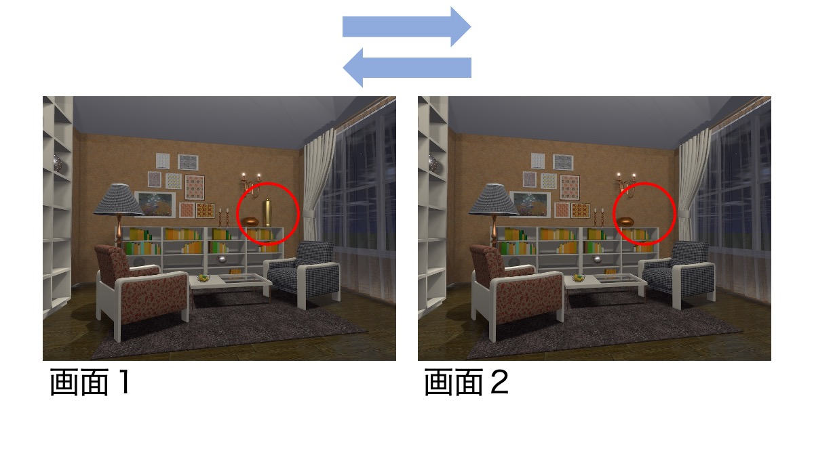
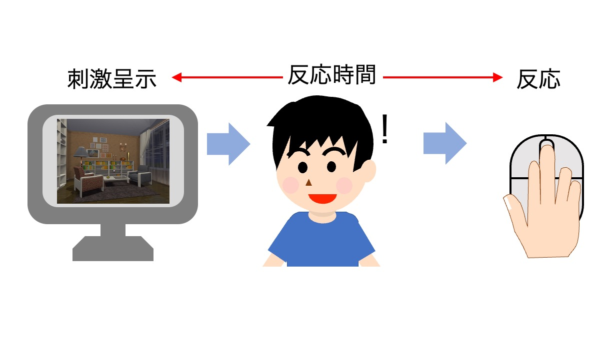
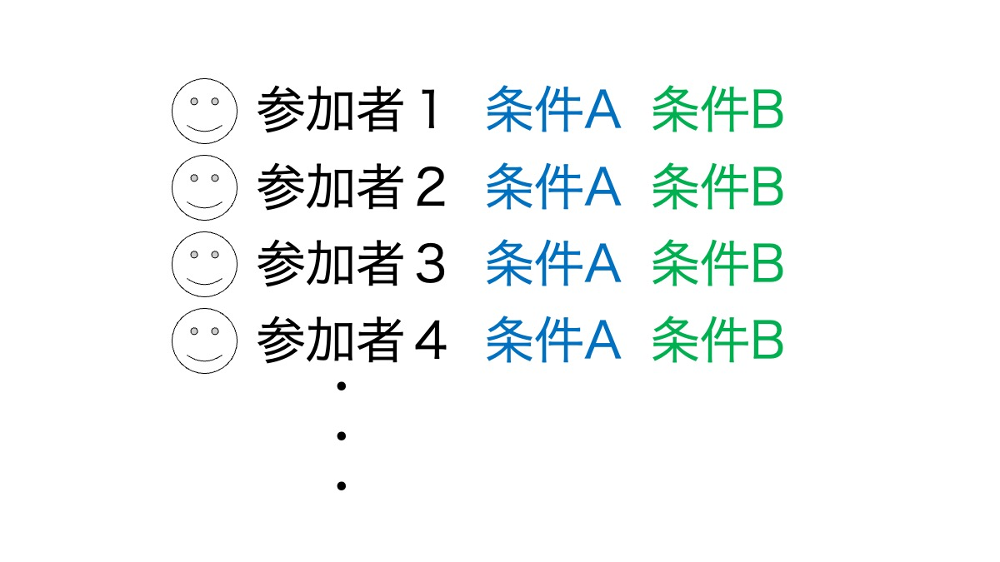
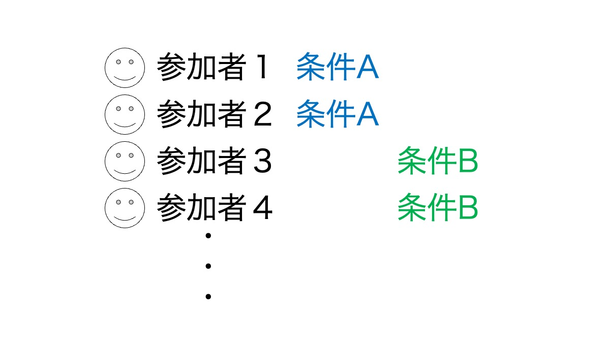

# 2. “反応時間“から”見つからない“を検討しよう: ―変化の見落とし―

## **概要**
視覚的に大きな変化であるにもかかわらず，その変化を見つけることができない，もしくは参加者自身が驚くほど変化を見つける課題の成績が悪くなる現象として「変化の見落とし」が知られています。みなさんも，テレビ番組などでこのデモンストレーションを見たことがあるかもしれません。今回は，"見つからない"を体験するだけでなく，画面に画像が呈示されてから変化を見つけて反応するまでの時間（反応時間）を測定し，"見つからない"を数量的に検討しましょう。

## **2.1.学習の目標**

- 運動の知覚（過渡的信号の検出）が変化検出におよぼす影響を体験しよう。
- １要因２水準の実験計画を理解しよう

## **2.2. 実験の背景**

### **見落としと注意**

日常生活において，目の前にあるはずなのに”見つからない”，”見落としてしまった”という体験があるように思います。これは，人間が一度に扱うことができる情報量に限界があり，見えている気がしていても，実際には情報が認識されたり，記憶されたりしていないことを意味しています。一部の情報を選択し，その他よりも優先する働きのことを **”注意”** と言いますが(Posner, 1980)，”注意”が向けられていない情報は驚くほど簡単に失われてしまいます。

### **変化の見落とし**

注意が情報の認識や記憶のために重要であることは， **”変化の見落とし現象”** によって示されていいます(Rensink, O’Regan, & Clark, 1997)。例えば，以下のように一部分だけが異なる２枚の画像を用意します。この画像を画面に0.2秒ごとに繰り返し表示します（フリッカー法）。



その際に２枚の画像の間に灰色のブランク画面（空白画面）を0.2秒表示します。参加者の課題は，２枚のどこが変化しているのかを答えることです。変化は十分に認識可能と思われるほど大きいですが，それにもかかわらずそれを検出できないか，または驚くほど遂行成績が悪くなります（詳しくは横澤・大谷, 2003）。

### **変化の見落としはなぜ生じるのか？**

変化の見落としはなぜ起こるのでしょうか？ ブランク画面を表示せずに２枚の画像を交互に表示すると，変化箇所は簡単に見つけることができます。変化箇所が動いて見えるためです。

このことから２つのことが分かります。

- １つ目は，変化箇所が動いて見えると見落としはかなり防ぐことができるということです。実世界では，多くの場合，環境の変化は突然の出現や運動（過渡的な信号）を伴って起こります。このような過渡的な信号に対して自動的に注意が引き付けられることが多くの研究で示されています(Yantis & Jonides, 1984)。そのため，変化箇所に注意が向き，見つけることができます。
- ２つ目は，変化した箇所が動いて知覚されないような場合には，画像を記憶して次の画像と照合する必要があり，そのような場合に見落としが生じるということです。私たちは一度に注意を向ける（または記憶する）ことが出来る情報量に限界があるため，画像情報の一部だけしか照合ができません。そのため，注意が向いた位置に偶然に変化が起こっていた場合以外は、見落とされてしまいます。

以下の２つの条件を比べてみてください。

 <a href="./image/noblank.gif" target="_blank">ブランク画面なし条件</a>
 <a href="./image/blank.gif" target="_blank">ブランク画面あり条件</a>


## **2.3. 体験してみよう**

今回の目的は，過渡的な信号が写真刺激を用いた変化検出課題の成績に及ぼす影響を体験することでした。２枚の画像（画像Aと部分的に変化した画像B）を交代させるフリッカー法を用いました。過渡的な信号を消すためにブランク画面を用いました。

- 独立変数はブランク画面の有無（あり条件，なし条件）でした。
- 従属変数として変化を検出するまでの反応時間を測定しました。



```tip
#### 独立変数とは？

実験や調査では，実施者側があらかじめパラメータを何種類か用意しておく場合があります。例えば，今回の場合は，「ブランク画面あり条件」と「ブランク画面なし条件」を用意しました。このように実施者側で操作する変数のことを**独立変数**といいます。

#### 従属変数とは？

実験や調査の参加者に回答してもらうことで取得される変数（操作の結果が表れる変数）のことを**従属変数**といいます。上記の例では反応時間が従属変数です。

#### 剰余変数とは？

実験や調査を実施する際には，できるだけ状況を揃えることが望ましいです。しかし，どうしても揃えることが出来ずに変化してしまう変数もあります。例えば，上記の例では「ブランク画面あり条件」と「ブランク画面なし条件」を実施する順番などです。このように実験・調査実施者の意図に反して変化してしまう変数のことを**剰余変数**と言います（詳しくは「2.7. より詳しく知りたい方へ」もご確認ください）。
```

## **2.4. 方法を見てみよう(詳細な説明は省略)**

### **実験参加者**

- 大学生○○名（女性○○名，男性○○名）が実験に参加した。参加者の平均年齢は○○歳 (SD = ○○) でした。

### **装置・刺激**

実験はパーソナルコンピューター，またはスマートフォンを用いて実施しました。刺激を制御するためのプログラムはlab.js (Henninger, Shevchenko, Mertens, Kieslich, & Hilbig, in press)を使用して作成しました。参加者管理システムJATOS (Lange, Kühn, & Filevich, 2015)でホスティングし，実施しました。

刺激材料として，練習では２枚，本試行では８枚の風景写真が実験に用いられました。各刺激は画面の一部が異なる写真のペア（刺激Aと刺激B）で構成されていました。刺激の変化箇所は，写真刺激の左上，右上，左下，右下のいずれかであり，変化する確率は４つのすべての領域で等しくなっていました。

### **手続き**

実験は個別にオンラインで行いました。実験は参加者がスペースキーを押すことで開始されました。各試行では，画面の中央に灰色のブランク画面が0.5秒提示された後，写真刺激が呈示されました。ブランク画面なし条件では，刺激Aが0.2秒呈示された後に刺激Bが同じ時間呈示されました。刺激AとBの交代は，参加者が反応キー（スペースキー）を押すまで繰り返されました。反応キーを押した後，写真が４つの領域（左上，右上，左下，右下）に線で分けられた刺激が提示されました。刺激AとBの変化がどの領域で起こったかを４択で反応しました。ブランク画面あり条件では刺激Aの後または刺激Bの後に空白画面が0.2秒呈示される以外は空白画面なし条件と同じでした。ブランク画面なし条件を最初に行った後，ブランク画面あり条件を行いました。各ブロックでは１試行の練習を行った後に，本試行を４試行行いました。

## **2.5. 結果を見てみよう**

条件ごとに反応時間の平均を算出しました。尚，正解した試行のみを集計しています。以下はクラウドソーシングサービスで募集をした実験の結果です。左側がPCで参加したグループ，右側がスマートフォンで参加したグループです。ブランク画面あり条件となし条件の結果が示されています（エラーバーは標準誤差です）。

少し専門的ですが，t検定という統計手法を用いた分析の結果，ブランク画面なし条件の反応時間にくらべてブランク画面あり条件の反応時間が有意に長いことが示されました。

```tip
#### 要因とは？
実験や調査で検討される対象（独立変数）は「**要因**」と呼ばれます。今回の場合は，「ブランク画面の有無」は「要因」です。また，1つの基準で条件が変化していることから１要因と考えます。

もし，「変化する位置（左上，右上，左下，右下）」によって変化を見つけるまでの反応時間が変わるか？ということにも注目したい場合は，「ブランク画面の有無」と「変化する位置」の２つの条件が変化していますので２要因となります。

#### 水準とは？
各要因には複数の条件が含まれます。上記の例では，「ブランク画面の有無」要因では「あり」と「なし」の２つの条件，「変化する位置」では「左上」，「右上」，「左下」，「右下」の４つの条件がありました。このような各要因における条件の違いは「**水準**」と呼ばれます。

#### 参加者内計画（対応あり）と参加者間計画（対応なし）
例えば，ブランク画面あり条件とブランク画面なし条件を同じ人が全て行うのか，別の人が行うのかで実験計画が変わってきます。
同じ人が全て行う場合は「参加者内計画（対応あり）」，別の人が行う場合は「参加者間計画（対応なし）」と呼ばれます。今回はブランク画面あり条件とブランク画面なし条件を同じ人が行っていますので，参加者内計画（対応あり）です。





#### 要因，水準，対応の有無はなぜ重要か？
要因，水準，対応の有無によってどんな統計的な検定手法を用いるかが変わってきます。今回は１要因2水準の参加者内計画（対応あり）ですので，「対応ありのt検定」という検定手法を用います。
```
## **2.6. どんな考察が考えられる？** 

このようにブランク画面あり条件では，なし条件に比べて反応時間が長いという結果になりました。ブランク画面あり条件となし条件の差は何を意味しているでしょう？

条件間の差は"見つからない"を体験して，画面内のどこが変化しているのか探している時間だと考えることができます。以下の図のように，２つの条件で反応時間をそれぞれ測定して条件間の差に注目することで，私たちが心の中で行っている作業の時間を数量的に検討することができます。

"見つからない"を体験することはこころの働きを知る上でもちろん重要ですが，反応時間を測定して数量化をすることで，心の働きについて１歩進んだ理解を得ることができます。

### **2.7. より詳しく知りたい方へ**

#### 順序効果とカウンターバランスについて

今回は常にブランク画面なし条件→あり条件の順番で実験を実施しました。そのため，順序効果が結果に影響を及ぼしている可能性があります。

**順序効果**とは課題を行った順序が結果に影響を及ぼすことです。練習効果，疲労効果，残留効果などが知られています。
- **練習効果**とは，前半に行った試行よりも後半に行った試行で，パフォーマンスが良くなる効果です。
- **疲労効果**とは，前半に行った試行よりも後半に行った試行で，パフォーマンスが悪くなる効果です。
- **残留効果**とは，先に行った課題の影響が次に行った課題に影響することです。

順序効果によって結果が歪むのを防ぐためには，２つの条件を行う順番を，ある参加者は「条件1→条件2」の順番，別の参加者は「条件2→条件1」の順番にするなどして，統制することが重要です。この方法のことを**カウンターバランス**という言い方をします。

## **2.8. 引用文献**

- Henninger, F., Shevchenko, Y., Mertens, U. K., Kieslich, P. J., & Hilbig, B. E. (in press). lab.js: A free, open, online study builder. *Behavior Research Methods*.
- Lange, K., Kühn, S., & Filevich, E. (2015). "Just Another Tool for Online Studies” (JATOS): An Easy Solution for Setup and Management of Web Servers Supporting Online Studies. *PLOS ONE*, *10*, e0130834.
- Posner, M. I. (1980). Orienting of attention. *Quarterly Journal of Experimental Psychology, 32*, 3-25.
- Rensink, R. A. , O'Regan, J. K., & Clark, J.J. (1997). To see or not to see: The need for attention to perceive changes in scenes. *Psychological Science*, *8*, 368-373.
- Yantis, S., & Jonides, J. (1984). Abrupt visual onsets and selective attention: Evidence from visual search. *Journal of Experimental Psychology: Human Perception & Performance*, *10*, 601-621.
- 横澤一彦・大谷智子（2003）．見落とし現象における表象と注意―非注意による見落としと変化の見落とし―，心理学評論，*46*, 482–500.

執筆者： 大杉尚之