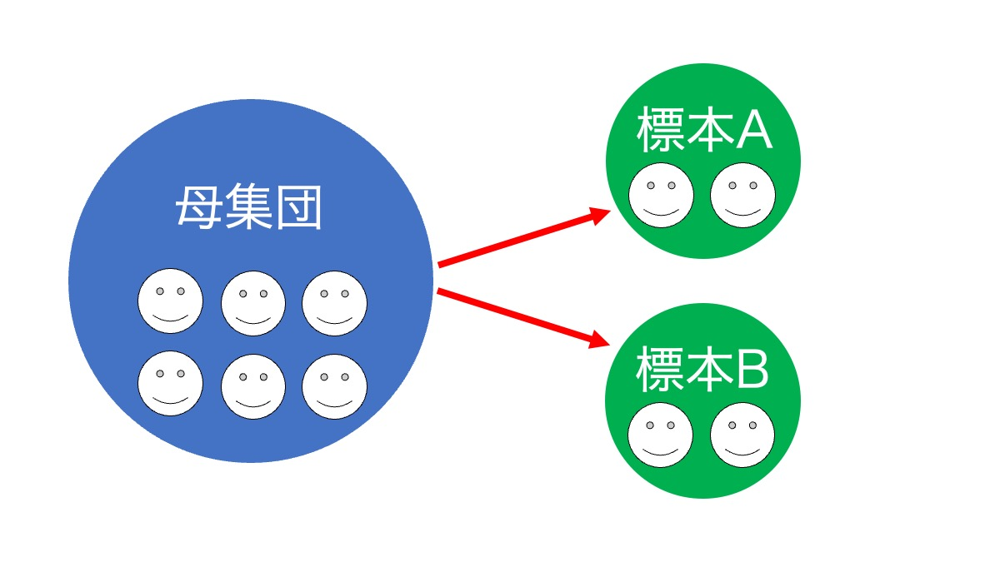

# 4. “グループのデータ”を見てみよう

## 概要
「こころ」を計ることで知りたいのは，個人の特性ではなくヒト一般の特性です。みなさんに体験してもらった実験を数十人に協力してもらい，集めたデータを集計した結果を見てみましょう。みなさんの結果の傾向と，グループの結果の傾向は似ていますか？もしくは似ていませんか？どちらでも気にする必要はありません。心理学の実験結果には個人差のばらつきが含まれます。このばらつきも含めた結果を解釈することこそが，「こころ」のプロセスを数量的に検討することなのです。

## 4.1. 多くの人からデータを集める
今回，反応時間や正答率を用いて，”見つからない”体験や記憶の正確性を数量的に示す方法を説明してきました。心理学者が，このように「こころ」を計ることで知りたいのは，個人の特性ではなくヒト一般の特性です。そこで数十人から数百人に協力してもらい，集計をした結果を見て判断をします。

### 母集団
調べたい対象全体のことを母集団といいます。ヒト一般の特性を知りたい場合には，母集団は人類全体（または日本人全体）を仮定することとなります。

### 標本（サンプル）
母集団から抽出した集団のことを標本（サンプル）といいます。実験や調査の参加者のことをさします。参加者の選び方はランダムサンプリング（無作為抽出）が基本です。標本（サンプル）の数のことを標本数またはサンプル数といいます。また，1標本（1サンプル）に含まれる参加者の人数のことを標本サイズまたはサンプルサイズといいます。

### 標本から母集団の特性を推定する
母集団の特性を知りたい場合に，最も確実な方法は母集団すべて（人類全体が母集団であればすべての人）のデータを取得することです。しかし，母集団が人類全体（または日本人全体）である場合，すべてのデータを取得することは現実的ではありません。そこで標本の結果（実験・調査参加者の結果）から母集団を推定します。

## 4.2. ばらつきも実は重要
みなさん自身の結果は、グループの結果の傾向と似ていますか？もしくは似ていませんか？どちらでも気にする必要はありません。心理学の実験結果には個人差のばらつきが含まれます。数十人から数百人のグループ全体の結果のばらつきは，心理学の実験・調査結果を解釈する上ではとても重要です。このばらつきも含めた結果を解釈することで，「こころ」のプロセスを検討します。

## 4.3. より詳しく知りたい方へ(詳細な説明は省略)

### ヒト一般の特性を推定することの難しさ
心理学では，ヒト一般の特性を知るために実験や調査を行ってきました。しかし，標本から母集団を推定するにあたって様々な難しい課題があります。例えば，これまではまったく同一の実験を繰り返した場合，異なる標本であっても同じ結果や同じ現象が示されることが仮定されてきました。しかし，そのようにならなかった（追試に失敗した）と報告がされるようになり(Open Science Collaboration, 2015; 池田・平石, 2016)，研究の再現性について心理学を含む多くの学問領域で大きな問題になっています。また，W.E.I.R.D.問題といい，心理学の実験や調査が主に「western(西洋の)」，「educated（教育を受けた）」，「industrialized(工業化した)」，「rich（豊かな）」，「democtatic（民主的な）」国で行われてきたため，標本に偏りがあるという指摘もあります。いずれにしても，ヒト一般の特性を知るためには様々な課題があり，課題への取り組みが続けられています。

### web実験・調査におけるばらつき
最近では，web実験・調査が盛んに行われるようになり，多くの参加者に比較的容易に協力してもらえるようになりました。しかし，web実験・調査では実施環境を揃えることが難しいという問題点もあります。実験室で行われる実験・調査では，ディスプレイまでの距離や画面の明るさ，色など多くの環境に関することを揃えて実施します。そのため，結果のばらつきについては個人差として考えればよかったのですが，web実験・調査の場合は実施する環境の違いも考慮に入れる必要があります。

執筆者： 大杉尚之・小林正法
